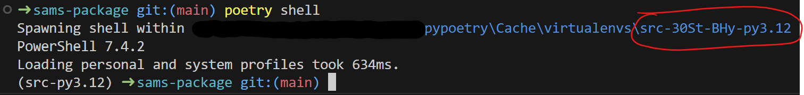
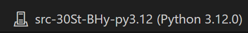

# Sam's Thesis data processor/cleaner

This is a simple data processor for Sam's thesis data. It reads the data from a CSV file, processes it and saves the results in a new CSV file.

## Installation

Since this is a python notebook you will need to have python installed. If you're using windows you can easily install python form the [Microsoft Store](https://apps.microsoft.com/detail/9ncvdn91xzqp?hl=en-us&gl=US). Otherwise you can download it from [here](https://www.python.org/downloads/).

After installing python you will need to install the dependencies prior to running the program. However first you will need to install poetry. You can do this by running the following commands:

```pwsh
# If you installed python using Microsoft Store, replace `python` with `python3` in the next line.
python -m pip install --user pipx
.\pipx.exe ensurepath
pipx install poetry
poetry install
```
Alternatively, you can follow the installation instructions from the [poetry website](https://python-poetry.org/docs/).

Now that all dependencies are installed you can initiate a virtual environment by running the following command:

```pwsh
poetry shell
```

Normally you should see something like this:

Keep note of the circled part, you will need it to select the kernel. In the right upper corner (assuming you're using Visual Studio Code) you will be able to select a kernel. Click on it and select the one with the same name as the circled part.



You should be good to go from now.
